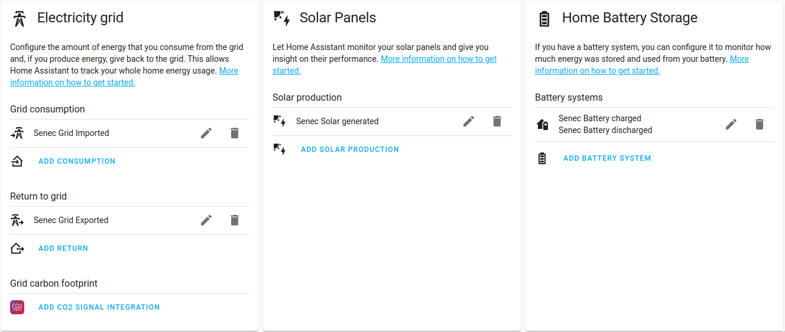

# Home Assistant sensor for SENEC.Home V3 
This fork was created from [mchwalisz/home-assistant-senec](https://gitgub.com/mchwalisz/home-assistant-senec) mainly
because I wanted additional fields and some configuration options (like polling interval). Since I own a
__SENEC.Home V3 hybrid duo__ I can __only test my adjustments in such a configuration__.

__Use this fork on your own risk!__

__Please note that this integration will _not work_ with Senec V4 systems!__ Senec V4 use a different communication
layer that is not compatible with previous Senec hardware. So if you are a V4 owner you might be in the uncomfortable
situation to develop a own integration from the scratch. [IMHO it's impossible to develop such a integration remotely]

## Modifications (compared to the original version) in this fork
- Added User accessible configuration option
- Added configurable _update interval_ for the sensor data (I use _5_ seconds, without any issue)
- Integrated variant of _pysenec_ python lib (almost every modification of this Home Assistant integration requires also
  an adjustment in the lib) - yes of course it would be possible to release also a lib derivative - but right now I am
  just a python beginner, and __I am lazy!__
- Added three additional sensors for each MPP1, MPP2, MPP3 [potential (V), current (A) & power (W)]
- Modified _battery_charge_power_ & _battery_discharge_power_ so that they will only return data >0 when the system
  state is matching the corresponding CHARGE or DISCHARGE state (including state variants)
- Added German "translation"

## Installation

### Hacs

- Install [Home Assistant Community Store (HACS)](https://hacs.xyz/)
- Add custom repository https://github.com/marq24/ha-senec-v3 to HACS
- Add integration repository (search for "Senec" in "Explore & Download Repositories")
    - Select latest version or `master`
- Restart Home Assistant to install all dependencies

### Manual

- Copy all files from `custom_components/senec/` to `custom_components/senec/` inside your config Home Assistant directory.
- Restart Home Assistant to install all dependencies

### Adding or enabling integration
#### My Home Assistant (2021.3+)

#### Manual
Add custom integration using the web interface and follow instruction on screen.

- Go to `Configuration -> Integrations` and add "Senec" integration
- Provide name for the device and it's address (hostname or IP)
- Provide area where the battery is located

## Home Assistant Energy Dashboard

This integration supports Home Assistant's [Energy Management](https://www.home-assistant.io/docs/energy/)

Example setup:

Resulting energy distribution card:

