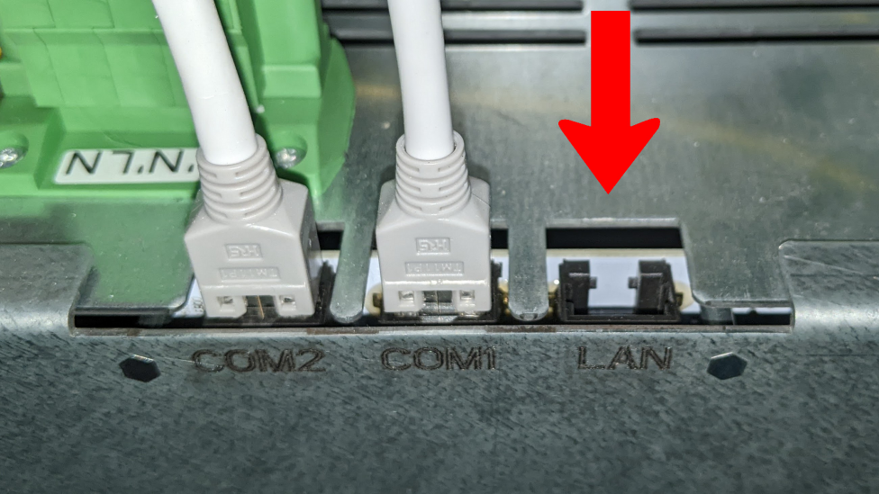
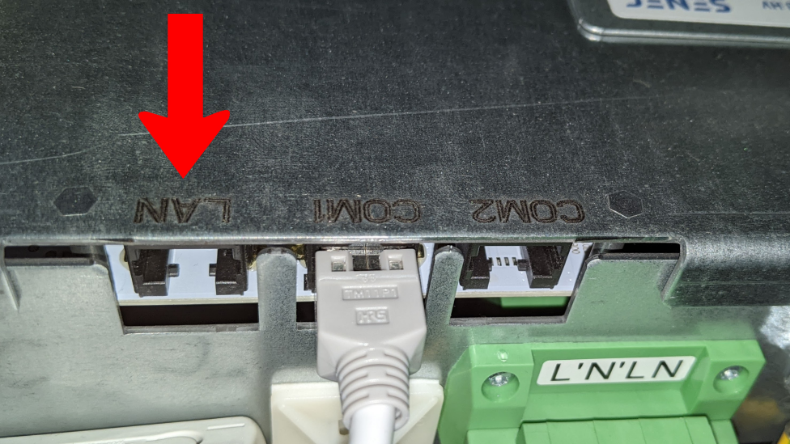

# Home Assistant sensor for SENEC.Home V3 
This fork was created from [mchwalisz/home-assistant-senec](https://gitgub.com/mchwalisz/home-assistant-senec) mainly
because I wanted additional fields and some configuration options (like polling interval). Since I own a
__SENEC.Home V3 hybrid duo__ I can __only test my adjustments in such a configuration__.

__Use this fork on your own risk!__

__Please note that this integration will _not work_ with Senec V4 systems!__ Senec V4 use a different communication
layer that is not compatible with previous Senec hardware. So if you are a V4 owner you might be in the uncomfortable
situation to develop a own integration from the scratch. [IMHO it's impossible to develop such a integration remotely]

## Modifications (compared to the original version) in this fork
- Added User accessible configuration option
- Added configurable _update interval_ for the sensor data (I use _5_ seconds, without any issue)
- Reading DeviceID, DeviceType, BatteryType & Version information
- If you connect the internal Inverter [in the case of the Duo there are even two (LV & HV)] to your LAN (see
  [details below](#inv-lnk)), then you can add these additional instances and directly access the data from the DC-AC
  converters  
- Added three additional sensors for each MPP1, MPP2, MPP3 [potential (V), current (A) & power (W)]
- Added BatteryCell Details [mainly disabled by default]
  - Module [A-D]: Current/Voltage/State of Charge (SoC)/State of Health (SoH)/Cycles
  - Cell temperature [1-6] per module [A-D]
  - Voltage per cell [1-14] per module [A-D] 
- Added Wallbox Details  [disabled by default]
- Modified _battery_charge_power_ & _battery_discharge_power_ so that they will only return data >0 when the system
  state is matching the corresponding CHARGE or DISCHARGE state (including state variants)
- Integrated variant of _pysenec_ python lib (almost every modification of this Home Assistant integration requires also
  an adjustment in the lib) - yes of course it would be possible to release also a lib derivative - but right now I am
  just a python beginner, and __I am lazy!__
- Added German "translation"

## Installation

### Hacs

- Install [Home Assistant Community Store (HACS)](https://hacs.xyz/)
- Add custom repository https://github.com/marq24/ha-senec-v3 to HACS
- Add integration repository (search for "Senec" in "Explore & Download Repositories")
    - Select latest version or `master`
- Restart Home Assistant to install all dependencies

### Manual

- Copy all files from `custom_components/senec/` to `custom_components/senec/` inside your config Home Assistant directory.
- Restart Home Assistant to install all dependencies

### Adding or enabling integration
#### My Home Assistant (2021.3+)

#### Manual
Add custom integration using the web interface and follow instruction on screen.

- Go to `Configuration -> Integrations` and add "Senec" integration
- Provide name for the device, and it's address (hostname or IP)
- Provide area where the battery is located

## Connecting the internal (build in) Senec Inverter Hardware to your LAN and use it in HA
The __SENEC.Home V3 hybrid duo__ have build in two inverters - called LV and HV. This hardware has its own LAN
connectors, but they have not been connected during the installation process (I guess by purpose).

### __DO THIS ON YOUR OWN RISK!__
Nevertheless, when you dismount the front and the right hand side panels you simply can plug in RJ45 LAN cables into
both of the inverters LAN connectors and after a short while you should be able to access the web frontends of the
inverters via your browser.

_Don't forget to assign fixed IP's to the additional inverter hardware. You can unplug the LAN cable for a short while
in order to make sure that the inverters will make use of the fixed assigned IP's._

### Position of SENEC.Inverter V3 LV LAN connector

On the front of the device

### Position of SENEC.Inverter V3 HV LAN connector _(hybrid duo only!)_

On the right hand side of the device

### Adding Inverter(s) to your HA
Once you have connected the inverter(s) with your LAN you can add another integration entry to your Senec Integration in
Home Assistant:

1. go to '__Settings__' -> '__Devices & Services__'
2. select the '__SENEC.Home__' integration.
3. there you find the '__Add Entry__' button (at the bottom of the '__Integration entries__' list)
4. specify the IP (or hostname) of the inverter you want to add
5. __important:__ assign a name (e.g. _INV_LV_).
 
Repeat step 3, 4 & 5 of this procedure, if you have build in two inverters into your Senec.HOME.

## Home Assistant Energy Dashboard

This integration supports Home Assistant's [Energy Management](https://www.home-assistant.io/docs/energy/)

Example setup:

Resulting energy distribution card:

